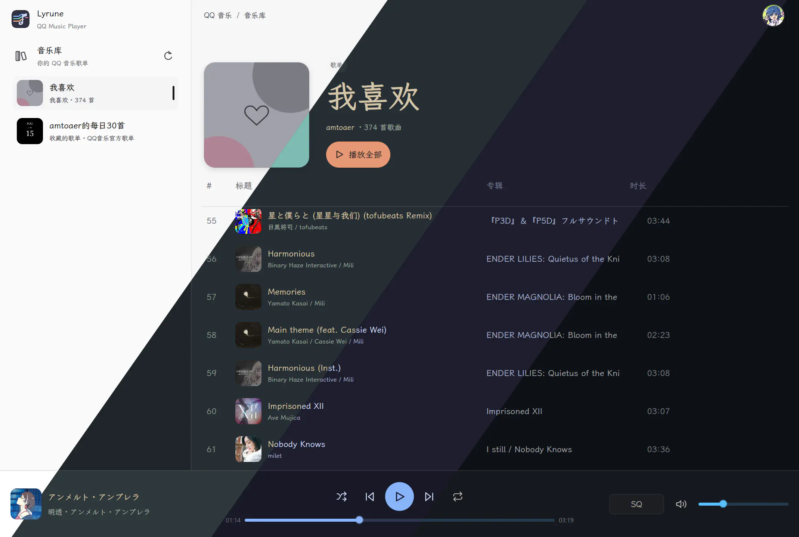
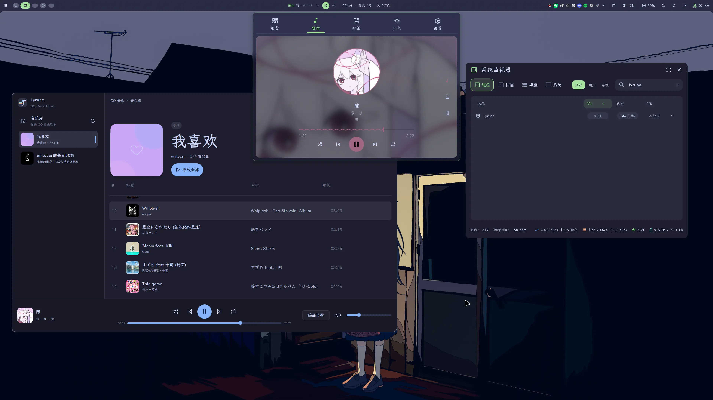

<p align="center">
  
</p>

<h1 align="center">Lyrune</h1>

<p align="center">
  <strong>A fast, native QQ Music desktop client built with Rust and GPUI.</strong>
</p>

<p align="center">
  面向桌面使用场景的非官方 QQ 音乐播放器：媒体内容优先、播放控制稳定，并与系统桌面自然集成。
</p>



<p align="center">
  <sub>Lyrune Neutral · Everforest Dark · Catppuccin Mocha · Ayu Dark</sub>
</p>

## 背景

<details>
<summary>展开查看</summary>

~~整个项目唯一一段人类手迹：~~

最近从 Spotify 切到了 QQ 音乐，发现 QQ 音乐 For Linux 相当难用：

1. 基于 Electron 占用较高；
2. 不显示也不能切换音质，不知道自己在播哪一档；
3. Mpris 支持较差，不显示音乐总时长。

正好手头有 Codex，心血来潮想做个 Rust + GPUI 的音乐播放器，这是我第一次体验纯粹的 Vibe，效果意外地好（~~至少是使用体验上，代码的话，应该..没问题吧？~~）。

设计部分大量参考了 Spotify，在与 Open Design 勾兑完成后由其转换为具体 Prompt 交由 Codex 执行。实际代码完全由 GPT 5.6 Sol Extra High 编写，在单个会话中完成，从新建文件夹到功能完备总耗时近一天，总消耗在 ChatGPT Pro 20x 七日限额的 10% 以内。

最终产物完全定位了上述三个缺点，占用低、可切音质、有完善的 Mpris 支持，可以完全满足我的需求：



下一步应该是实现搜索、歌词、歌手页、专辑页，但对我来说不是刚需，随缘开发了。

欢迎 Linux 用户测试，另外项目理论上可以跨平台，Windows / Mac 用户也可以尝试编译。

~~好了后面全都是 AI Slop 了（x~~

</details>

## 功能

### 媒体库与播放

- 使用 QQ 音乐 App 扫码登录，凭据保存在系统钥匙串中。
- 同步“我喜欢”和用户歌单，支持分页加载、短 TTL 缓存与手动强制刷新。
- 播放器持有独立播放队列；浏览或切换左侧歌单不会改变当前队列和曲目。
- “播放全部”会补全并播放整个歌单，而不是只使用界面已懒加载的部分。
- 持久化当前曲目、播放进度、音量、主题、窗口尺寸和侧栏宽度。
- 支持随机播放、上一首、播放/暂停、下一首、列表循环和单曲循环。

### 音质与流媒体

- 识别并选择标准、HQ、SQ、Hi-Res、臻品音质、臻品全景声和臻品母带。
- 结合歌曲文件元数据过滤明显不存在的音质，并只按“当前音质及更低音质”自动回退。
- 边下载边播放，支持部分缓存、HTTP Range 续传、重新连接和 seek。
- 缓存 QQ 音乐 CDN 调度结果并进行节点选优，降低高码率音源的卡顿概率。
- 图片与音频均使用本地文件缓存；GPUI 只读取已经落盘的图片。

实际可用音质由歌曲、账号权益和 QQ 音乐返回结果共同决定。

### 桌面集成

- 关闭窗口后继续播放；左键点击托盘图标可重新打开窗口。
- 单例运行：再次启动 Lyrune 只会唤醒现有窗口，不会创建第二套播放器状态。
- Linux 使用 StatusNotifierItem 托盘；Windows 和 macOS 使用 `tray-icon` 后端。
- Linux 支持 MPRIS，可在桌面媒体控件中播放、暂停、切歌、seek、调节音量与循环状态。
- 优先使用系统 `system-ui` 字体，并针对中、英、日文混排保持一致的排版层级。

### 视觉系统

- 内置 Lyrune Neutral、Catppuccin Mocha、Ayu Dark 和 Everforest Dark。
- 统一的媒体图标、播放器状态、键盘焦点、响应式列隐藏与固定底部播放器。
- 扁平化 Lyrune SVG 图标同时用于应用品牌位和跨平台托盘。

## 运行

需要 Rust 1.97 或更高版本：

```bash
git clone https://github.com/amtoaer/lyrune.git
cd lyrune
cargo run --release
```

Linux 还需要：

- 可用的 Secret Service，例如 GNOME Keyring 或 KWallet；
- 可用的系统音频输出；
- Fontconfig，用于解析 `system-ui` 字体；
- 支持 StatusNotifierItem 的桌面托盘宿主（可选，但建议启用）。

如果系统钥匙串不可用，应用会保留本次登录供当前进程使用，但不会把凭据降级保存为明文。

Arch Linux 可以使用 `packaging/arch/PKGBUILD` 从最新源码构建并安装：

```bash
mkdir -p dist/arch
cd packaging/arch
PKGDEST="$(realpath ../../dist/arch)" makepkg -si
```

生成的包名为 `lyrune-git`，同时会安装应用菜单项和 SVG 图标。

如果安装包只在构建机或具有兼容指令集的机器上使用，可以构建针对本机 CPU 优化的 `lyrune-git-native`：

```bash
PKGDEST="$(realpath ../../dist/arch)" makepkg -p PKGBUILD.native -si
```

该版本会向 Rust 编译器传递 `-C target-cpu=native`，因此不适合分发到 CPU 型号或指令集未知的机器。

## 数据与缓存

Lyrune 使用系统标准目录保存数据。在 Linux 上主要包括：

- `~/.config/lyrune/settings.json`：界面、播放和恢复状态；
- `~/.cache/lyrune/`：图片、音频、歌单与 CDN 调度缓存；
- 系统钥匙串中的 `dev.lyrune` 项：QQ 音乐登录凭据。

音频缓存键由 provider、歌曲 `mid`、媒体 `media_mid` 和音质共同生成。缓存不会保存临时播放 URL，也不会写入可直接导出的音乐标签。

## Workspace

- `crates/lyrune-app`：GPUI 桌面应用、播放器、缓存和桌面集成。
- `crates/qqmusic-api`：内置 QQ 音乐协议实现，不需要额外启动 Node.js 服务。
- `docs/screenshots`：README 使用的真实界面截图。

项目使用 [GPUI](https://github.com/zed-industries/zed/tree/main/crates/gpui) 与
[gpui-component](https://github.com/longbridge/gpui-component)。第三方依赖及协议实现来源见
[`THIRD_PARTY_NOTICES.md`](THIRD_PARTY_NOTICES.md)。

## 参考与致谢

`crates/qqmusic-api` 直接引入并修改自
[AstronW/netease-qq-music-api](https://github.com/AstronW/netease-qq-music-api)；上游版本、
版权与许可证信息记录在 [`THIRD_PARTY_NOTICES.md`](THIRD_PARTY_NOTICES.md)。

在理解和交叉验证 QQ 音乐的登录、歌单、播放链接、音质文件字段及下载行为时，还参考了：

- [L-1124/QQMusicApi](https://github.com/L-1124/QQMusicApi)：Python QQ 音乐 API 封装及配套文档；
- [yakult-green-tea/qq-music-api](https://github.com/yakult-green-tea/qq-music-api)：Node.js、Docker 与 Electron 场景的 QQ 音乐 API 实现；
- [CharlesPikachu/musicdl](https://github.com/CharlesPikachu/musicdl)：覆盖 QQ 音乐等平台的下载流程实现；
- [Yyyangshenghao/simple-music](https://github.com/Yyyangshenghao/simple-music)：包含 QQ 音乐音源的跨平台桌面播放器实现。

以上参考项目不是 Lyrune 的运行时服务或依赖；Lyrune 的 QQ 音乐调用由仓库内置的 Rust 实现完成。

## 当前限制

- QQ 音乐接口是未公开协议，可能随上游调整而变化。
- 当前只实现 QQ 音乐 App 扫码，不包含微信扫码。
- MPRIS 仅适用于 Linux；不同桌面环境对托盘和媒体控件的展示可能不同。
- 音频缓存暂未实现容量上限和 LRU 清理。
- 项目目前主要在 Linux / Wayland 环境开发和验证；Arch Linux 提供源码构建包，尚未发布预编译包。

> Lyrune 是非官方客户端，与腾讯及 QQ 音乐无隶属或认可关系。请遵守当地法律、QQ 音乐服务条款及内容授权要求。
